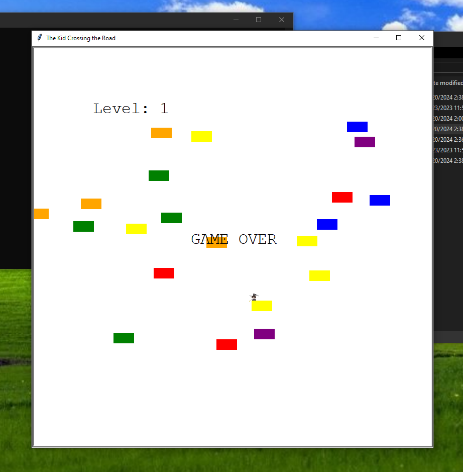

# The Kid Crossing the Road

**The Kid Crossing the Road** is a simple yet engaging game where the player navigates a character across a road filled with moving obstacles. The goal is to reach the other side without getting hit by any of the obstacles.

## Table of Contents
- [Gameplay](#gameplay)
- [Controls](#controls)

### Prerequisites
- Python 3.x
- Pygame library

## Gameplay

In **The Kid Crossing the Road**, you control a character that must cross a busy road filled with moving obstacles. The game consists of multiple levels with increasing difficulty.

- **Objective**: Reach the other side of the road without getting hit by any obstacles.
- **Obstacles**: Colorful blocks representing moving vehicles or other hazards.
- **Levels**: Each level has a unique layout and speed of obstacles.

## Controls

- **wasd keyboards**: Use the WASD keys to move the character up, down, left, and right.

---

Feel free to give feedback so that we can improve the project. If you need further customization or additional sections, let me know!!